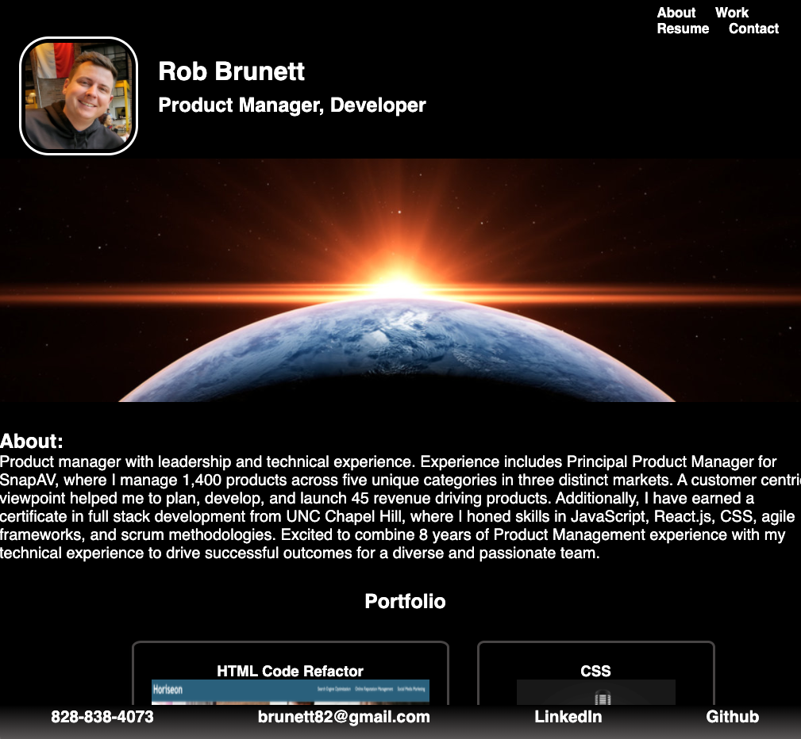

# Portfolio Page

## Project Goal

Develop a personal portfolio which showcases my development projects so potential employers can assess my capabilities and determine if I am a good candidate for their open postion.

## Project Scope

1. Present name, recent photo, and links to sections in the page about myself, work, and contact info.
2. Links in top navigation scroll the page to corresponding sections when clicked.
3. Image of first application in 'Portfolio' section should be larger than the others.
4. All images of applicaitons in 'Portfolio' section are links to deployed projects.
5. Page layout is responsive and adapts to viewports of different sizes.

## Deployed Portfolio Screen-Shot

## Deployed Application
https://brunett82.github.io/portfolio/

## Project Owner

Rob Brunett

## Project Completion Date

04/10/2021

